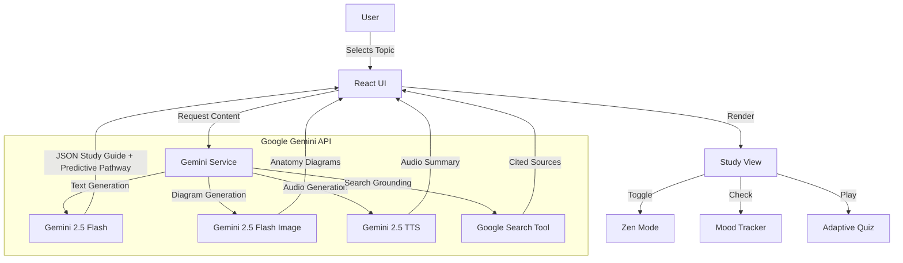

# 🏥 MedRecap AI

**Gamified, AI-Powered Medical Learning Platform for Clinical Mastery, Wellness, and Accessibility.**

> A specialized medical study aid bridging foundational sciences with clinical application. Ideal for doctors, students, and lifelong learners to quickly recap topics with depth, supported by AI.

---

## 📖 Introduction / Problem Statement

**The Challenge:** Medical students and professionals often struggle to bridge the gap between foundational sciences (anatomy, physiology) and clinical application (pathology, diagnosis) while managing immense cognitive load and stress. The sheer volume of information can lead to burnout, and traditional linear study methods often lack the adaptability required for neurodiverse learners or those needing rapid, context-aware integration.

**The Solution:** **MedRecap AI** solves this by using Google's Gemini 2.5 models to generate adaptive study guides, gamified quizzes, and visual recall exercises in real-time. It creates a personalized, stress-free learning environment that prioritizes retention, mental well-being, and accessibility.

---

## 🌟 Core Pillars

<strong>1. 🤖 AI for Healthcare</strong>

Leveraging the latest in Generative AI to provide accurate, high-yield medical education.

*   **Real-time Content Generation:** Uses `gemini-2.5-flash` to create study guides, flowcharts, and summaries instantly.
*   **Predictive Study Pathways:** Analyzes user performance to suggest the next logical topic to study, creating a personalized curriculum.
*   **Natural Language Question Answering:** An integrated AI tutor (Learning Chat) answers clinical questions and cites sources using Google Search grounding.
*   **Smart Difficulty Adjustment:** Quizzes adapt dynamically (Easy, Medium, Hard) based on user proficiency.

<strong>2. 🧠 Mental Health & Wellness</strong>

Designed specifically to reduce cognitive load and prevent burnout during intense study sessions.

*   **Mental Fatigue Tracker:** A dashboard tool for quick self-assessment of stress and focus levels.
*   **Zen Mode:** A distraction-free "Focus Mode" that removes UI clutter to reduce cognitive overwhelm.
*   **Mindfulness Integration:** Encourages breathing exercises when high stress is reported.
*   **Gamification:** Uses streaks, XP points, and achievements to make studying rewarding rather than draining.

<strong>3. ♿ Accessibility & Patient Support</strong>

Ensuring medical education is accessible to all learners, including those with diverse needs.

*   **Text-to-Speech (TTS):** `gemini-2.5-flash-preview-tts` generates natural-sounding audio summaries for auditory learners.
*   **Visual Accessibility:** Built-in **High Contrast Mode** and **Large Text** options for visually impaired users.
*   **Dual Learning Modes:** Splits content into "Foundational" vs. "Clinical" views to help neurodiverse learners connect abstract concepts to concrete applications.
*   **Multi-modal Learning:** Offers text, audio, interactive diagrams, and drawing tools to suit different learning styles.

<strong>4. 🌍 Public Health & Community Impact</strong>

Scalable education tools for better-prepared doctors globally.

*   **Global Resource Library:** Integration with standardized clinical guidelines ensures knowledge is applicable worldwide.
*   **Offline-First Design:** The application UI is lightweight and designed to function well in regions with limited internet bandwidth (simulated offline capabilities).
*   **Cloud Syncing:** Progress and streaks are saved (simulated via local storage) to allow continuous learning across sessions.
*   **Population Impact:** By training better doctors faster, the platform aims to improve long-term public health outcomes.

---

## ✨ Key Features

<strong>🧠 AI-Powered Study Guides</strong>

*   **Dual-View Learning:** Seamlessly switch between Foundational Sciences (Year 1) and Clinical Application (Year 3).
*   **Mnemonics & High-Yield Key Points:** Automatically generated memory aids for rapid retention.
*   **Mermaid.js Flowcharts:** Visualizes complex pathways (e.g., nervous system tracts) instantly.
*   **Predictive Pathways:** Suggests related topics to build a comprehensive knowledge graph.

<strong>🎮 Gamified Learning & Active Recall</strong>

*   **Matching Games:** Drag-and-drop mini-games for terminology and definitions.
*   **Visual Recall:** AI-generated anatomical diagrams with hide/reveal functionality for self-testing.
*   **Interactive Sketchpad:** A digital whiteboard to draw and reinforce spatial memory of anatomical structures.

<strong>📝 Smart Quiz System</strong>

*   **Clinical Vignettes:** Generates USMLE-style case questions on the fly.
*   **Adaptive Difficulty:** 
    *   *Easy:* Basic fact recall.
    *   *Medium:* Clinical correlation.
    *   *Hard:* Complex reasoning and obscure presentations.
*   **AI Analytics Dashboard:** Visualizes progress, streaks, topics mastered, and mastery levels.

<strong>💬 AI Tutor & Search Grounding</strong>

*   **Context-Aware Chat:** Ask follow-up questions about the specific topic being studied.
*   **Google Search Integration:** The AI uses the `googleSearch` tool to find and cite real-world sources, ensuring up-to-date clinical information.

---

## 🏗️ Architecture

<strong>🧩 System Flow (Mermaid Diagram)</strong>

<strong>🛠️ Tech Stack</strong>

*   **Frontend**: React 19, TypeScript, Tailwind CSS
*   **AI Logic**: `gemini-2.5-flash` (Content Generation, Quiz Logic, Chat)
*   **AI Vision**: `gemini-2.5-flash-image` (Anatomy Diagrams)
*   **AI Voice**: `gemini-2.5-flash-preview-tts` (Accessibility/TTS)
*   **Visualization**: Mermaid.js (Process Flows), HTML5 Canvas (Sketchpad)
*   **Icons**: Lucide React

---

## 🚀 How to Use

1.  **Check In**: Use the **Mental Fatigue Tracker** on the dashboard to assess your focus.
2.  **Search**: Enter any medical topic (e.g., "Circle of Willis" or "Myocardial Infarction").
3.  **Listen**: Click the **Listen** button to hear an AI-narrated summary (Text-to-Speech).
4.  **Focus**: Toggle **Zen Mode** or **High Contrast** via Settings to reduce overwhelm.
5.  **Study**: Review the Dual-View content, play the Matching Game, or use the Sketchpad.
6.  **Visual Recall**: Click "Visualize Anatomy" to generate a diagram, then toggle visibility to test yourself.
7.  **Quiz**: Select "Hard" difficulty to test your clinical reasoning with AI-generated vignettes.
8.  **Ask**: Use the floating "Ask Tutor" button to clarify doubts with cited sources.
9.  **Track**: Watch your **XP and Streaks** grow on the dashboard.
